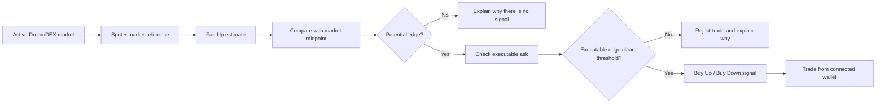

# Edge Desk

**Explainable, non-custodial trading for DreamDEX Event Contracts on Somnia Shannon.**

Edge Desk watches short BTC and ETH Up/Down markets on DreamDEX, compares spot with each market's reference price, builds a transparent **Fair Up estimate**, and only produces a trade signal when the **price you can actually trade** still leaves enough edge.

No custody. No black-box AI. Just transparent logic, executable edge, and wallet-based trading.

[**Live App**](https://desk.moonrider.online/) · [DreamDEX Docs](https://docs.dreamdex.io/) · [Shannon Explorer](https://shannon-explorer.somnia.network/)

---

## Why Edge Desk?

DreamDEX Event Contracts are short Up/Down markets. Their order books continuously price the outcome while the underlying spot price keeps moving.

That creates two problems for a trader:

1. **A pricing gap is not automatically a trade.** The market midpoint may look attractive while the actual ask is already too expensive.
2. **A number without an explanation is hard to trust.** Traders need to know what moved, what the market is pricing, and why a signal exists.

Edge Desk closes that gap.

It compares spot with the market reference, calculates a rule-based Fair Up estimate, measures the difference against the market, and then checks the **executable ask** before showing a trade signal.

If the midpoint looks good but the available price destroys the edge, Edge Desk rejects the trade and explains why.

---

## How it works



### 1. Find an active market

Edge Desk watches active BTC and ETH Up/Down Event Contracts on DreamDEX and can prioritize a preferred asset and market duration.

### 2. Build a Fair Up estimate

The model maps the distance between spot and the market's reference price into a bounded fair-value estimate:

```text
Fair Up = clamp(
  0.5 + 8 × (spot - reference) / reference,
  0.05,
  0.95
)
```

This is an intentionally simple, explainable heuristic.

> **Fair Up is not a calibrated probability of winning.** It is a rule-based fair-value estimate used to compare spot movement with the market.

### 3. Measure the midpoint gap

The Up market midpoint is used to identify a potential side:

```text
market midpoint = (best bid + best ask) / 2
midpoint gap    = Fair Up - market midpoint
```

The midpoint is informational. Edge Desk does **not** treat it as the price a trader can necessarily execute at.

### 4. Validate the executable edge

Before producing a signal, Edge Desk checks the actual ask for the side being bought.

```text
Up executable edge   = Fair Up - Up ask

Down executable edge = (1 - Fair Up) - Down ask
```

A trade signal only survives when the executable edge still clears the configured threshold.

This prevents a common failure mode where the midpoint appears mispriced but the spread makes the trade unattractive.

### 5. Explain the decision

Every signal, rejection, or wait state gets a plain-English reason.

Example:

> BTC is 0.42% above the reference price. Fair Up is 61.4% versus a 55.0% market midpoint. Up is available at 56.0%, leaving a 5.4% executable edge. Signal: Buy Up.

If the ask removes the edge, Edge Desk says so instead of presenting a misleading signal.

---

## Core features

### Explainable signals

Every decision is derived from visible market inputs and rule-based math. No LLM or opaque model is used to decide whether to trade.

### Executable-price validation

Edge Desk separates the **midpoint gap** from the **executable edge**. The real ask must still satisfy the configured threshold before a signal qualifies.

### Non-custodial wallet trading

Users connect their own Somnia Shannon wallet and submit trades from the browser. User funds are not deposited into Edge Desk.

### Signal-only by default

The server agent is configured to observe and generate signals by default:

```env
DRY_RUN=true
AGENT_TRADE=false
```

Automatic server-side trading is opt-in and requires explicit configuration.

### Position and claim tracking

The app can surface wallet positions and eligible settled Event Contract outcomes so users can claim from their connected wallet.

### Market and activity views

Edge Desk includes dedicated views for:

- the current trading desk
- active markets
- wallet positions and claims
- recent signals and trade activity
- signal and trading configuration

---

## Non-custodial architecture

There are two deliberately separate execution paths.

### Connected wallet

The browser wallet is used for user-initiated trading and claims.

```text
User
  ↓
Connected wallet
  ↓
DreamDEX / Somnia Shannon
```

The user signs the transaction. Edge Desk does not take custody of the wallet.

### Optional automation wallet

A server private key is only required if automatic agent trading is explicitly enabled.

```text
Signal engine
  ↓
AGENT_TRADE=true
  ↓
Optional server wallet
  ↓
DreamDEX / Somnia Shannon
```

The default configuration keeps this path disabled.

---

## Architecture

| Component | Responsibility |
|---|---|
| `src/agent/tick.ts` | Market scan, edge calculation, signal generation, persistence |
| `src/lib/edge.ts` | Fair Up, midpoint gap, executable-edge logic, explanations |
| `scripts/agent-loop.ts` | Always-on signal loop |
| `GET /api/status` | Read-only desk status and heartbeat |
| `POST /api/agent/tick` | Secret-gated manual signal check |
| Desk UI | Displays market state, edge, reasons, and actions |
| Wallet hooks | Connected-wallet trading and claim flow |
| `data/` | Lightweight persisted runtime state |

The app uses `marketId` / symbol as the market identity rather than assuming a pool address uniquely identifies a market.

Writes are gated on the market's on-chain trading status.

---

## Tech stack

- **Next.js 15** — App Router
- **React 19**
- **TypeScript**
- **Tailwind CSS**
- **DreamDEX / Somnia Markets SDK** — `@somnia-chain/markets-sdk`
- **wagmi v2**
- **viem**
- **TanStack Query**
- **Somnia Shannon testnet** — chain ID `50312`

DreamDEX Event Contract interaction is handled through the Somnia Markets SDK rather than a separate DreamDEX HTTP trading API.

---

## Run locally

### Requirements

- Node.js 22+
- npm
- a writable `data/` directory
- a Somnia Shannon wallet if you want to test wallet actions

### Install

```bash
git clone https://github.com/abdoulore/edge-desk.git
cd edge-desk

npm ci
cp .env.example .env
```

Review `.env` before starting the app.

### Production-style local run

```bash
npm run build
npm run start:all
```

Then open:

```text
http://localhost:3000
```

The desk is available at:

```text
http://localhost:3000/app/desk
```

### Run the web app and agent separately

Terminal 1:

```bash
npm run dev
```

Terminal 2:

```bash
npm run agent
```

---

## Environment configuration

The full template is in [`.env.example`](./.env.example).

| Variable | Default | Purpose |
|---|---:|---|
| `NETWORK` | `testnet` | Network mode |
| `DRY_RUN` | `true` | Keeps the agent in signal-only mode |
| `AGENT_TRADE` | `false` | Enables/disables automatic server trading |
| `EDGE_THRESHOLD` | `0.05` | Minimum executable edge required for a signal |
| `COPY_SIZE` | `1` | Default connected-wallet trade size |
| `VENUE_ID` | testnet venue | DreamDEX Event Contract venue |
| `PREFERRED_ASSET` | `BTC` | Preferred underlying |
| `PREFERRED_INTERVAL_SEC` | `900` | Preferred market duration |
| `AGENT_INTERVAL_MS` | `8000` | Signal-loop interval |
| `PRIVATE_KEY` | empty | Optional; only needed for explicitly enabled server-side execution |
| `EDGE_DESK_SECRET` | empty | Secret for protected operator mutations |
| `NEXT_PUBLIC_EDGE_DESK_SECRET` | empty | Matching local UI value for operator controls |

### Important security note

Never commit `.env`, private keys, or real operator secrets.

A `PRIVATE_KEY` is **not required** for normal connected-wallet use.

---

## Useful scripts

```bash
npm run dev          # Next.js development server
npm run build        # Production build
npm run start        # Next.js production server
npm run agent        # Signal agent loop
npm run start:all    # Web app + agent
npm run lint         # Lint
npm run verify       # Project verification scripts
```

---

## Testnet funding

The project runs on **Somnia Shannon testnet**.

Test assets used by the app include Shannon gas and test USDC.

Faucet/community access currently referenced by the project:

https://t.me/+XHq0F0JXMyhmMzM0

---

## On-chain transaction evidence

Example Shannon testnet transactions from funded testing:

- [Transaction 1](https://shannon-explorer.somnia.network/tx/0x8c35a5ca04cb0635de516cca7e2dd164c36c5f476f126e0d363bef4f6a57b76a)
- [Transaction 2](https://shannon-explorer.somnia.network/tx/0xc216ae7b412ecd934409eaa4479cfe1b641e0151dc85570c347ee1ba5dda0c9f)

---

## Deployment

Edge Desk needs:

- an always-on Node process for the signal loop
- persistent storage for `data/*.json`
- port `3000` exposed by the web process

The repository includes:

- `Dockerfile`
- `railway.toml`
- `render.yaml`
- `scripts/start-all.sh`

For Railway, mount persistent storage at:

```text
/app/data
```

The application is not designed around ephemeral serverless storage.

Keep:

```env
AGENT_TRADE=false
```

unless you intentionally want the server agent to submit trades using a configured private key.

---

## Known limitations

Edge Desk is an experimental trading tool built for testnet.

- **Fair Up is a heuristic, not a calibrated probability.**
- Edge validation currently focuses on top-of-book executable pricing rather than a full depth-aware market-impact model.
- Runtime state is stored in filesystem JSON and therefore requires persistent storage.
- Indexer-backed portfolio data can occasionally differ from direct on-chain state.
- The UI does not itself create the always-on signal process; the agent loop must also be running.
- This project is not financial advice and does not guarantee profitable trades.

---

## Why no black-box AI?

Explainability is part of the product, not a marketing layer added afterward.

The decision path is deterministic and inspectable:

```text
spot
  → reference-relative move
  → Fair Up estimate
  → market midpoint comparison
  → executable ask check
  → threshold
  → Buy Up / Buy Down / No signal
```

A trader can see why Edge Desk acted or waited.

That is the point.

---

## Hackathon

Edge Desk was built for the **Somnia × DreamDEX Event Contracts** hackathon.

The project focuses on turning short-window Event Contract order books into an explainable, non-custodial trading workflow rather than an opaque automated bot.

---

## License

MIT. See [`LICENSE`](./LICENSE).
